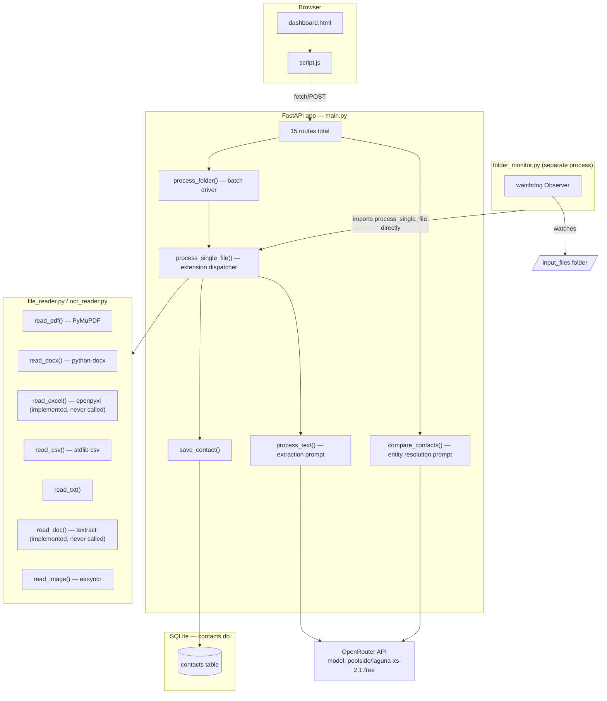
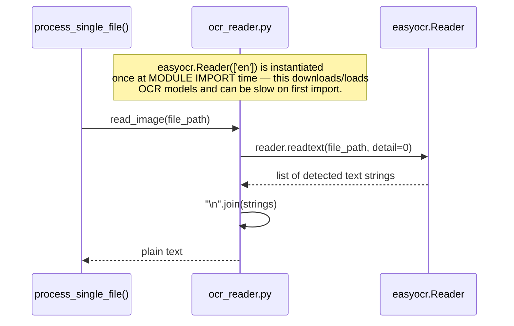
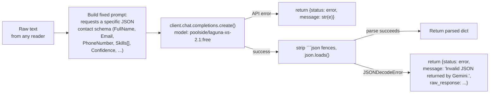
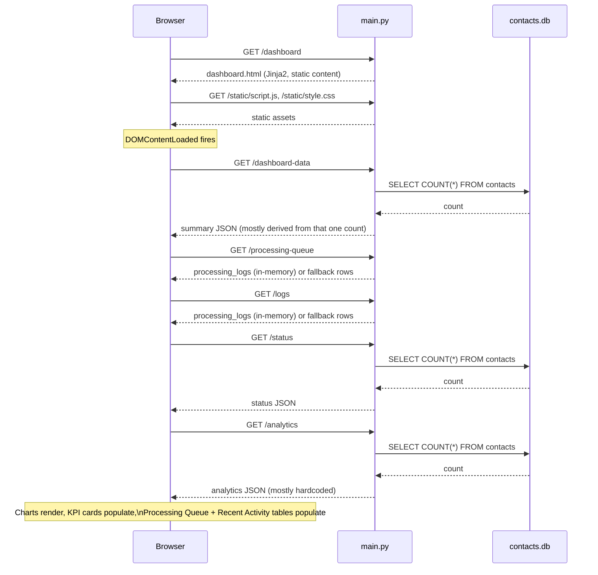

# Project Architecture — ContactIQ AI

This describes the system exactly as implemented across `main.py`, `database.py`, `models.py`, `file_reader.py`, `ocr_reader.py`, `folder_monitor.py`, `script.js`, and `dashboard.html`.

## High-level components

## Frontend

- **`templates/dashboard.html`** — a single static-ish HTML page (served through Jinja2 via `GET /dashboard`, though it uses no actual Jinja templating syntax beyond the `{"request": request}` context FastAPI requires — it's effectively static HTML). It defines every dashboard "view" as a `<section>` toggled with inline `display:none`/`display:''`, not separate pages/routes — navigation is entirely client-side.
- **`static/script.js`** — vanilla ES6, no framework, no build step. One `DOMContentLoaded` listener drives boot: theme, sidebar, topbar, ripple buttons, scroll-reveal, toasts, then sequentially loads dashboard data, the processing queue, recent activity, AI health, and charts. Sidebar menu clicks toggle which `<section>` is visible and trigger that section's own data loader.
- **Charts** are rendered with Chart.js (CDN), instantiated separately for the main dashboard's four charts (`trendChart`, `dupChart`, `ocrChart`, `confChart`) and the dedicated Analytics page's four charts (`analyticsTrendChart`, etc.) — same `/analytics` data, two independent sets of Chart.js instances.
- **No client-side routing, no state management library, no bundler** — every function is a plain top-level or `DOMContentLoaded`-scoped function communicating via `fetch()` to same-origin JSON endpoints.

## Backend

- **Single-file FastAPI app** (`main.py`) — no routers/blueprints split out; every route is declared directly on the top-level `app` object.
- **All route handlers are synchronous (`def`, not `async def`)** — FastAPI runs these in a thread pool automatically. There is no `async`/`await` anywhere in `main.py` outside of route *declarations* that happen to be sync functions (i.e., there's no actual async I/O in this codebase — the OpenAI client call, file reads, and DB queries are all blocking calls executed in a worker thread).
- **In-memory application state**, not persisted:
  - `processing_logs` (list) — appended to by `process_folder()`; read by `GET /logs` and `GET /processing-queue`.
  - `processed_files` (set) — tracks which filenames in `input_files/` have already been handled by `process_folder()`, so repeated calls skip them. Reset to empty on every process restart.
  - `crm_contacts` (list) — declared, never read or written anywhere. Dead code.
- **LLM client**: a single module-level `OpenAI(api_key=..., base_url="https://openrouter.ai/api/v1")` instance, reused across requests, targeting OpenRouter's `poolside/laguna-xs-2.1:free` model for both extraction and comparison prompts.

## Database

See [DATABASE.md](./DATABASE.md) for full column-level detail. In short: one SQLite file (`contacts.db`), one table (`contacts`, ~40 columns, all optional except the integer primary key `id`), no foreign keys, no migrations, deduplication handled entirely in application code (`save_contact()`), not via database constraints.

## OCR flow

- Triggered only for `.jpg`, `.jpeg`, `.png`, `.bmp` files in `process_single_file()`.
- `easyocr.Reader(['en'])` is created **once, at module import time** in `ocr_reader.py` — English only, no language configuration exposed elsewhere in the code.
- The extracted text is passed straight into the same `process_text()` LLM extraction pipeline used for every other file type — OCR output isn't treated any differently once it becomes plain text.
- No OCR confidence score is captured or stored — the `ocr_confidence` field the OCR Logs dashboard table tries to render is never populated by anything in `main.py`.

## AI extraction flow (`process_text`)

- The prompt is a single hardcoded string built with an f-string, requesting a fixed 30-ish-field JSON object (see `README.md`'s API docs for the exact fields) and instructing the model not to guess missing values.
- **The error message says "Gemini"** even though the client is actually configured against OpenRouter with the `poolside/laguna-xs-2.1:free` model — this is a leftover/incorrect string, not a sign of an actual Gemini integration anywhere in the code.
- There is no retry logic, no temperature/parameter tuning, and no schema validation against the requested JSON shape beyond `json.loads()` succeeding — if the model returns valid JSON that's missing fields or has the wrong types, it will still be accepted and passed into `save_contact()`.
- `compare_contacts()` follows the identical pattern (build prompt → call same model → strip fences → parse JSON) for a completely separate task (same-person judgment between two contact dicts) — implemented, but never called from `script.js`.

## Processing queue

Two independent ways files get processed, both writing to the same `contacts` table, but only one of them updates the dashboard's visible state:

1. **Manual batch — `POST /process-folder`** (triggered by the dashboard's "Run Processing" button): lists every file in `input_files/`, skips anything already in `processed_files`, calls `process_single_file()` per file, and — critically — **this is the only code path that appends to `processing_logs`**. This is what makes files show up in the Processing Queue and OCR Logs/Recent Activity views.
2. **Automatic — `folder_monitor.py`** (a separate, manually-started process using `watchdog`): watches `input_files/` for new files and calls `process_single_file()` directly the moment a file is created. **This path does not touch `processing_logs` or `processed_files` at all** — files processed this way are saved to the database (subject to the same phone/email dedupe check) but never appear in the Processing Queue, OCR Logs, or Recent Activity dashboard views, and aren't tracked as "already processed," so a later manual `/process-folder` run could attempt them again (and would then correctly detect them as duplicates via `save_contact()`'s phone/email check, assuming those fields were extracted consistently).

`GET /processing-queue` itself does no processing — it just reshapes whatever is currently in `processing_logs` into the row shape the dashboard table expects, falling back to two hardcoded sample rows if `processing_logs` is empty.

## Analytics

`GET /analytics` is the single source for both the main dashboard's analytics section and the dedicated Analytics page's charts. Only one number in its response is real: `total_contacts`, a live `COUNT(*)` on the `contacts` table, placed as the last element of a 7-element `files_processed` array. Every other value returned — the first six elements of `files_processed`, all of `duplicates_found`, and the entirety of `ocr_distribution` and `ai_confidence` — is a hardcoded constant, not a time-series or a computed statistic. There is no historical tracking (no timestamps stored anywhere that would let the system reconstruct "files processed per day/week"), so any real trend charting would require schema changes (e.g. a `created_at` column on `contacts`, or persisting `processing_logs` with timestamps) that don't currently exist.

## Request lifecycle (typical dashboard page load)

Every one of these calls is a fresh, independent HTTP request — there's no WebSocket, no server-sent events, and no polling/auto-refresh loop in `script.js`; the dashboard only re-fetches when a Refresh button is clicked or a sidebar view is opened.
