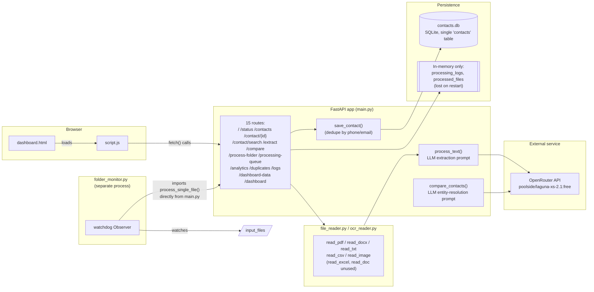
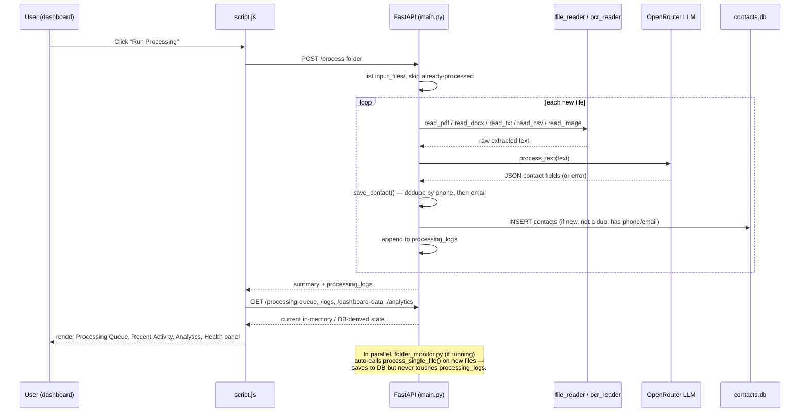
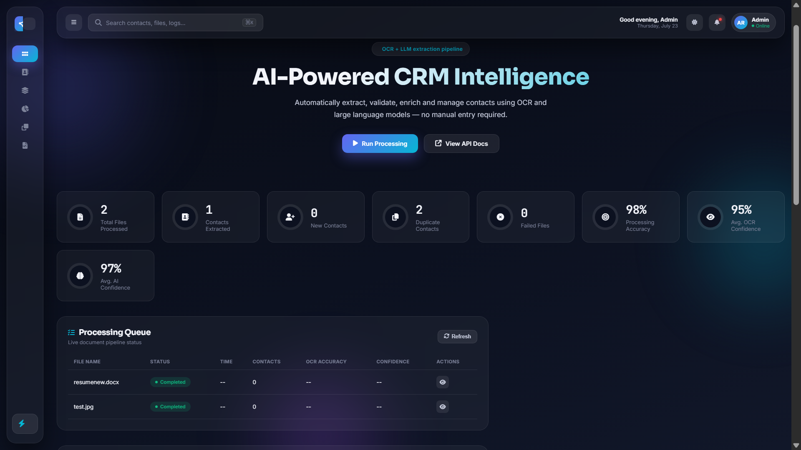
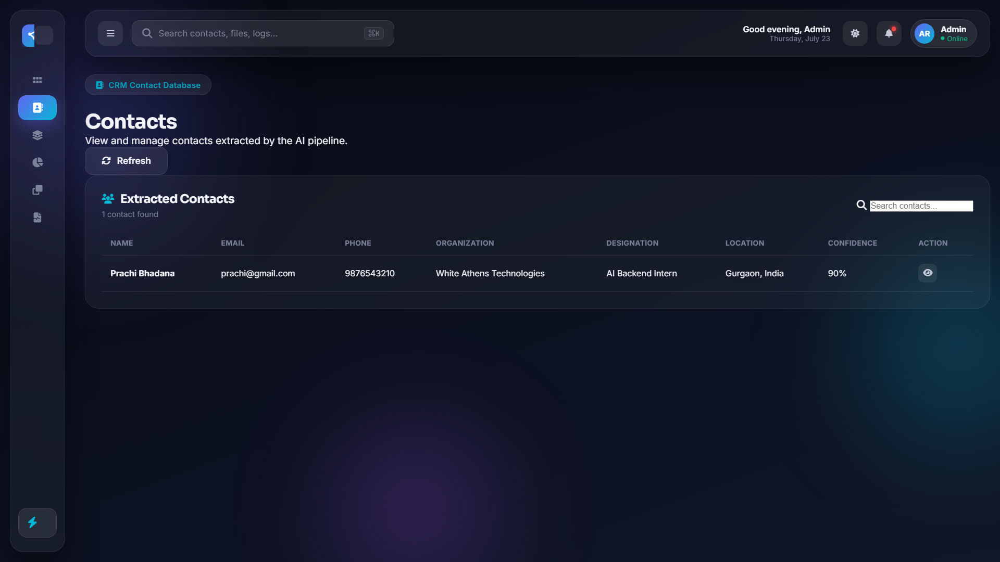
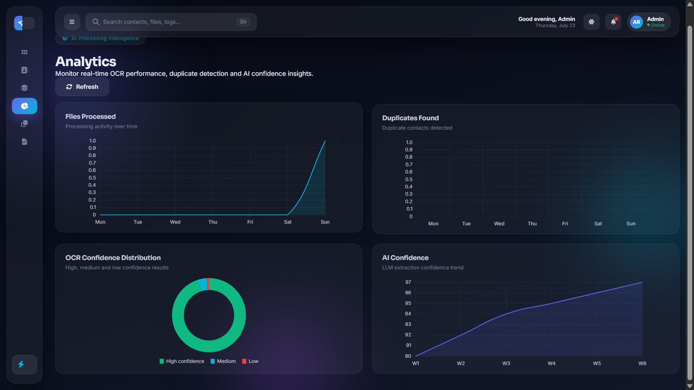
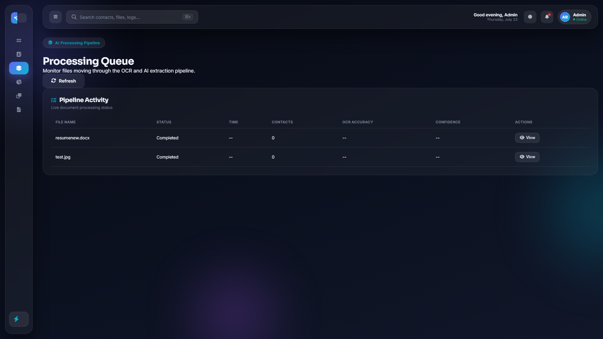
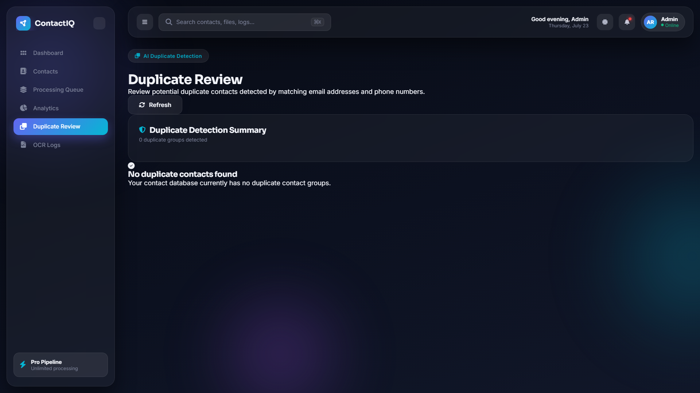
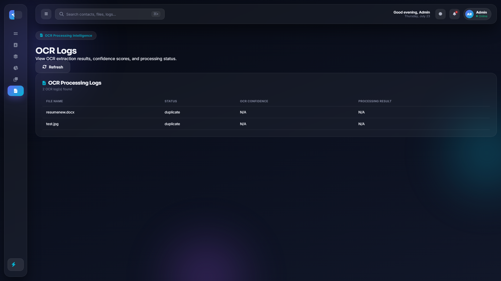

# 🚀 ContactIQ AI
> AI-Powered Contact Intelligence Platform

Extract structured contact information from resumes, business cards, PDFs, images, DOCX, DOC, TXT, CSV and Excel files using AI + OCR and automatically organize them into a searchable CRM dashboard. 

## Overview

ContactIQ AI is a FastAPI backend paired with a static HTML/JS dashboard. It reads text out of PDFs, DOCX files, images (via OCR), CSVs, and plain text; sends that text to an LLM (via OpenRouter) with a fixed extraction prompt; parses the returned JSON into a `Contact` record; deduplicates by phone/email; and persists it to a local SQLite database. Files can be processed either in a manual batch (dashboard's "Run Processing" button) or automatically as they arrive, via a separate folder-watching script (`folder_monitor.py`).

## Business Problem

Manually re-typing contact details from unstructured documents into a CRM is slow and error-prone. ContactIQ AI addresses this by turning a document or image into a structured record automatically, flagging exact-match duplicates so the same person isn't entered twice, and giving a dashboard view of what's been processed, what's a duplicate, and basic aggregate stats.

## Real Features (only implemented)

- ✅ **Text-to-contact extraction** via a single LLM prompt (`process_text()`), requesting a fixed ~30-field JSON schema (name, contact details, address, professional info, government IDs, social links, skills, and a confidence score).
- ✅ **Multi-format ingestion**: `.pdf` (PyMuPDF), `.docx` (python-docx), `.txt`, `.csv`, images `.jpg/.jpeg/.png/.bmp` (EasyOCR).
- ✅ **Two independent ingestion paths**:
  1. **Manual batch** — `POST /process-folder`, triggered by the dashboard's "Run Processing" button. Iterates `input_files/`, skips anything already tracked in the in-memory `processed_files` set, and is the *only* path that populates the dashboard's Processing Queue / OCR Logs / Recent Activity views (via `processing_logs`).
  2. **Automatic folder watch** — `folder_monitor.py`, a standalone script using `watchdog` that calls `process_single_file()` the instant a new file appears in `input_files/`. This path saves to the database but **does not** update `processing_logs` or `processed_files` — files processed this way are invisible to the dashboard's Processing Queue/OCR Logs/Recent Activity, and aren't marked as "already processed" for the batch path.
- ✅ **Application-level deduplication on save** — `save_contact()` checks for an existing contact by normalized phone, then normalized email, before inserting.
- ✅ **Duplicate-group review** (`GET /duplicates`) — a separate, on-demand full scan grouping *all* contacts sharing an email or phone, independent of the save-time check.
- ✅ **Contact search** (`GET /contact/search`) by name/email/phone, case-insensitive.
- ✅ **AI entity resolution** (`POST /compare`) — a second LLM prompt judging whether two contact JSON blobs are the same person. **Implemented, not called anywhere in `script.js`.**
- ✅ **Processing Queue, OCR Logs / Recent Activity, Analytics, Duplicate Review, AI Health Panel, and Contacts** dashboard views, each backed by its own endpoint (see API docs below).

## Technology Stack

Confirmed directly from source:

| Layer | Technology | Evidence |
|---|---|---|
| Backend framework | FastAPI | `main.py` |
| ASGI server | Uvicorn | standard FastAPI companion; used to run `main:app` |
| Data validation | Pydantic | `ContactInput`, `CompareInput` in `main.py` |
| ORM | SQLAlchemy | `database.py`, `models.py` |
| Database | SQLite (`contacts.db`) | `database.py`: `DATABASE_URL = "sqlite:///contacts.db"` |
| LLM provider | OpenRouter, via the `openai` Python SDK pointed at `https://openrouter.ai/api/v1` | `main.py`, model `poolside/laguna-xs-2.1:free` |
| PDF parsing | PyMuPDF (`fitz`) | `file_reader.py` |
| DOCX parsing | `python-docx` | `file_reader.py` |
| Excel parsing | `openpyxl` | `file_reader.py` (`read_excel`, implemented but unused — see caveat above) |
| Legacy `.doc` parsing | `textract` | `file_reader.py` (`read_doc`, implemented but unused — see caveat above) |
| OCR | `easyocr` | `ocr_reader.py`, English model, loaded once at import time |
| Filesystem watching | `watchdog` | `folder_monitor.py` |
| Env config | `python-dotenv` | `main.py`: `load_dotenv()` |
| Templating | Jinja2 | `Jinja2Templates(directory="templates")` |
| Static files | FastAPI `StaticFiles` | mounted at `/static` |
| Frontend | Vanilla JS (ES6), HTML, CSS — no framework, no build step | `script.js`, `dashboard.html` |
| Charts | Chart.js (CDN) | `dashboard.html` |
| Icons / fonts | Font Awesome 6.6.0, Google Fonts (Sora, Inter, JetBrains Mono) | `dashboard.html` |

`requirements.txt` is present in the repository but **empty (0 bytes)** — no pinned versions exist anywhere. See [DEPLOYMENT.md](./DEPLOYMENT.md) for the dependency list reconstructed from imports.

## Folder Structure

```
.
├── main.py               # FastAPI app: all routes, LLM prompts, save/dedupe logic
├── database.py            # SQLAlchemy engine/session/Base — SQLite at contacts.db
├── models.py               # Contact ORM model (single table, ~40 columns)
├── file_reader.py          # PDF/DOCX/CSV/TXT/Excel/legacy-DOC text extraction
├── ocr_reader.py            # EasyOCR-based image text extraction
├── folder_monitor.py        # Standalone watchdog script — auto-processes new files
├── contacts.db               # SQLite database file (created automatically if absent)
├── requirements.txt          # Present but empty
├── .env                       # OPENROUTER_API_KEY (never commit — see Security Notes)
├── .gitignore                  # Ignores .env, venv/, __pycache__/
├── static/
│   └── script.js              # Dashboard client-side logic
├── templates/
│   └── dashboard.html          # Served via GET /dashboard
└── input_files/                # Watched/processed folder (not itself provided, but referenced by both main.py and folder_monitor.py)
```

## Mermaid Architecture Diagram



## Mermaid Workflow Diagram



## Dashboard Modules

| Module | Sidebar view | Backed by |
|---|---|---|
| Main Dashboard | default view | `/dashboard-data`, `/processing-queue`, `/logs`, `/status`, `/analytics` |
| Contacts | `contactsView` | `/contacts` |
| Processing Queue (dedicated) | `processingQueueView` | `/processing-queue` |
| Analytics (dedicated) | `analyticsView` | `/analytics` |
| Duplicate Review | `duplicateReviewView` | `/duplicates` |
| OCR Logs | `ocrLogsView` | `/logs` (two of its four columns, `ocr_confidence`/`processing_result`, are never populated by the backend) |


## Database Documentation

See [DATABASE.md](./DATABASE.md) for the full column list, confirmed directly against both `models.py` and the live `contacts.db` schema. Summary: one SQLite database, one table (`contacts`, 40 columns, integer PK `id`, no foreign keys), no migrations, deduplication enforced only in application code.

## Installation

```bash
git clone <your-repo-url>
cd <repo-folder>

python -m venv venv
source venv/bin/activate        # Windows: venv\Scripts\activate

# requirements.txt is empty in this repo — install the reconstructed list:
pip install fastapi uvicorn pydantic python-dotenv openai sqlalchemy jinja2 \
            pymupdf python-docx openpyxl easyocr textract watchdog

cp .env.example .env
# edit .env and set OPENROUTER_API_KEY to your own key

mkdir -p input_files   # folder read by /process-folder and folder_monitor.py

uvicorn main:app --reload
```

Then open **http://127.0.0.1:8000/dashboard**.

## Deployment

See [DEPLOYMENT.md](./DEPLOYMENT.md).

## Environment Variables

See [.env.example](./.env.example). Only one variable is read anywhere in the code:

| Variable | Used for | Where |
|---|---|---|
| `OPENROUTER_API_KEY` | Authenticates the `openai`-SDK client against OpenRouter | `main.py`, line 20 |

`database.py` hardcodes its SQLite path (`sqlite:///contacts.db`) rather than reading it from the environment — there is no `DATABASE_URL` variable to set.

## Security Notes

- Environment variables are stored in `.env`.
- `.env.example` is provided for configuration.
- Sensitive credentials should never be committed.
- SQLite is used for local development.

## Screenshots

## 📸 Dashboard Screenshots

### 🏠 Main Dashboard


### 👥 Contacts


### 📊 Analytics


### ⏳ Processing Queue


### 🔄 Duplicate Review


### 📜 OCR Logs


## Future Improvements

- Populate `ocr_confidence`/`processing_result` in log entries.
- Populate `requirements.txt` with pinned versions.
- Add authentication, CORS policy, and encryption/masking for `pan`/`aadhaar` before any non-local deployment.
- Wire `/extract`, `/compare`, `/contact/{contact_id}`, and `/contact/search` into the dashboard, or remove them if unplanned.
- Add a migrations tool (e.g. Alembic) if the schema is expected to evolve.

## 🤝 Contributing

Contributions, suggestions, and bug reports are welcome.

If you'd like to contribute:

1. Fork the repository.
2. Create a new feature branch.
3. Commit your changes.
4. Open a Pull Request.

Please open an issue first if you'd like to discuss major changes.

## 📄 License

This project is licensed under the MIT License. See the [LICENSE](LICENSE) file for details.
